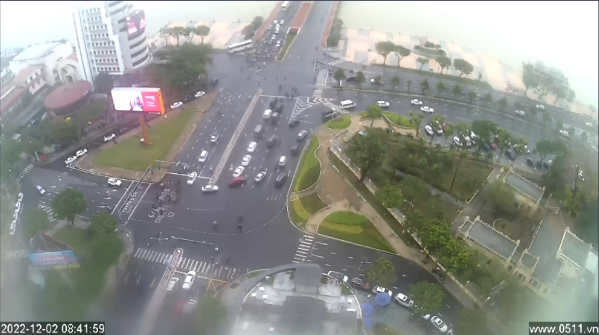

[![Contributors][contributors-shield]][contributors-url]
[![Forks][forks-shield]][forks-url]
[![Stargazers][stars-shield]][stars-url]
[![Issues][issues-shield]][issues-url]
[![MIT License][license-shield]][license-url]
[![LinkedIn][linkedin-shield]][linkedin-url]

<!-- PROJECT LOGO -->

 

<h3 align="center">Optimized Detectron2 for high altitude traffic monitoring camera
</h3>

    A modified Detectron model and hyperparameter to optimize for the use of object detection using high-altitud camera
     
     
    <a href="https://github.com/notabota/Optimized-Detectron2-for-high-altitude-traffic-monitoring-camera">View Demo</a>
    ·
    <a href="https://github.com/notabota/Optimized-Detectron2-for-high-altitude-traffic-monitoring-camera/issues">Report Bug</a>
    ·
    <a href="https://github.com/notabota/Optimized-Detectron2-for-high-altitude-traffic-monitoring-camera/issues">Request Feature</a>
  

<!-- TABLE OF CONTENTS -->

  
Table of Contents

  <ol>
    <li>
      <a href="#about-the-project">About The Project</a>
    </li>
    <li>
      <a href="#details">Details</a>
    </li>
    <li><a href="#roadmap">Roadmap</a></li>
    <li><a href="#contributing">Contributing</a></li>
    <!-- <li><a href="#license">License</a></li> -->
    <li><a href="#contact">Contact</a></li>
    <!-- <li><a href="#acknowledgments">Acknowledgments</a></li> -->
  </ol>

<!-- ABOUT THE PROJECT -->

## About The Project

<!-- [![Product Name Screen Shot][product-screenshot]](https://example.com) -->

This project is built specifically for the use of object panoptic segmentation on cameras that are low resolution and have to capture a wide area where vehicles are small-scale compared to the video resolution.

<!-- Use the `BLANK_README.md` to get started. -->

<a href="#readme-top">back to top</a>

<!-- DETAILS -->

## Details

#### Specifications of the camera

Due to the position of the camera, its image outputs have some special properties compared to standard object detection algorithm:
* The objects are too small and in low resolution.
* Vehicles are ofter crowded and merge into each other, which is indistinguishable.
* Since the traffic network and the camera postion is static, it's inefficient to perform Detectron on unrelated location on the images. Unfortunately, when capturing from above, most of the scene being captured can be considered background.
* The environment are unstable with frequently changing brightness, lighting and shadow, blurness, weather condition,...

#### How is that correlated with Detectron

* Small and low resolution object resulted in small feature map that render the convolution network nearly unsuable. 
* The default anchor boxes and ground truth is also too sizeable compared to the objects.
* The convolutional stride is too large to be able to capture the vehicles
* While already being low quality, Detectron auto resize the images to speedup the process. In this case, the precision and accuracy is more important.
* While this is not really a change of the Detectron, we also tell the model to not take an unnecessary interest into constant background area.

<a href="#readme-top">back to top</a>

<!-- ROADMAP -->

## Roadmap

See the [open issues](https://github.com/notabota/Optimized-Detectron2-for-high-altitude-traffic-monitoring-camera/issues) for a full list of proposed features (and known issues).

<a href="#readme-top">back to top</a>

<!-- CONTRIBUTING -->

## Contributing

Contributions are what make the open source community such an amazing place to learn, inspire, and create. Any
contributions you make are **greatly appreciated**.

If you have a suggestion that would make this better, please fork the repo and create a pull request. You can also
simply open an issue with the tag "enhancement".

1. Fork the Project
2. Create your Feature Branch (`git checkout -b feature/AmazingFeature`)
3. Commit your Changes (`git commit -m 'Add some AmazingFeature'`)
4. Push to the Branch (`git push origin feature/AmazingFeature`)
5. Open a Pull Request

<a href="#readme-top">back to top</a>

[//]: # (<!-- LICENSE -->)

[//]: # (## License)

[//]: # ()

[//]: # (
<a href="#readme-top">back to top</a>
)

[//]: # ()

[//]: # (<!-- CONTACT -->)

## Contact

Nguyễn Nguyên Vũ

* [![Gmail][gmail]]() - **nnv2205owo@gmail.com**
* [![Facebook][facebook]](https://www.facebook.com/nnv2205owo/) - **facebook.com/nnv2205owo**
* [![LinkedIn][linkedin]](https://www.linkedin.com/in/nnv2205owo/) - **linkedin.com/in/nnv2205owo**
* [![Upwork][upwork]](https://www.upwork.com/freelancers/~012078434f80806fe1) - **upwork.com/freelancers/~
  012078434f80806fe1**

Project Link: [https://github.com/notabota/Optimized-Detectron2-for-high-altitude-traffic-monitoring-camera](https://github.com/notabota/Optimized-Detectron2-for-high-altitude-traffic-monitoring-camera)

<a href="#readme-top">back to top</a>

<!-- ACKNOWLEDGMENTS -->

[//]: # (## Acknowledgments)

[//]: # ()

[//]: # (Use this space to list resources you find helpful and would like to give credit to. I've included a few of my favorites)

[//]: # (to kick things off!)

[//]: # ()

[//]: # (* [Choose an Open Source License]&#40;https://choosealicense.com&#41;)

[//]: # (* [GitHub Emoji Cheat Sheet]&#40;https://www.webpagefx.com/tools/emoji-cheat-sheet&#41;)

[//]: # (* [Malven's Flexbox Cheatsheet]&#40;https://flexbox.malven.co/&#41;)

[//]: # (* [Malven's Grid Cheatsheet]&#40;https://grid.malven.co/&#41;)

[//]: # (* [Img Shields]&#40;https://shields.io&#41;)

[//]: # (* [GitHub Pages]&#40;https://pages.github.com&#41;)

[//]: # (* [Font Awesome]&#40;https://fontawesome.com&#41;)

[//]: # (* [React Icons]&#40;https://react-icons.github.io/react-icons/search&#41;)

[//]: # (
<a href="#readme-top">back to top</a>
)

<!-- MARKDOWN LINKS & IMAGES -->

[Firebase]: https://img.shields.io/badge/firebase-%23039BE5.svg?style=for-the-badge&logo=firebase

[Firebase-url]: https://firebase.google.com/

[contributors-shield]: https://img.shields.io/github/contributors/othneildrew/Best-README-Template.svg?style=for-the-badge

[contributors-url]: https://github.com/notabota/Optimized-Detectron2-for-high-altitude-traffic-monitoring-camera/graphs/contributors

[forks-shield]: https://img.shields.io/github/forks/othneildrew/Best-README-Template.svg?style=for-the-badge

[forks-url]: https://github.com/notabota/Optimized-Detectron2-for-high-altitude-traffic-monitoring-camera/network/members

[stars-shield]: https://img.shields.io/github/stars/othneildrew/Best-README-Template.svg?style=for-the-badge

[stars-url]: https://github.com/notabota/Optimized-Detectron2-for-high-altitude-traffic-monitoring-camera/stargazers

[issues-shield]: https://img.shields.io/github/issues/othneildrew/Best-README-Template.svg?style=for-the-badge

[issues-url]: https://github.com/notabota/Optimized-Detectron2-for-high-altitude-traffic-monitoring-camera/issues

[license-shield]: https://img.shields.io/github/license/othneildrew/Best-README-Template.svg?style=for-the-badge

[license-url]: https://github.com/notabota/Optimized-Detectron2-for-high-altitude-traffic-monitoring-camera/blob/master/LICENSE.txt

[linkedin-shield]: https://img.shields.io/badge/-LinkedIn-black.svg?style=for-the-badge&logo=linkedin&colorB=555

[linkedin-url]: https://linkedin.com/in/nnv2205owo

[facebook]: https://img.shields.io/badge/Facebook-1877F2?style=for-the-badge&logo=facebook&logoColor=white

[gmail]: https://img.shields.io/badge/Gmail-D14836?style=for-the-badge&logo=gmail&logoColor=white

[linkedin]: https://img.shields.io/badge/LinkedIn-0077B5?style=for-the-badge&logo=linkedin&logoColor=white

[upwork]: https://img.shields.io/badge/UpWork-6FDA44?style=for-the-badge&logo=Upwork&logoColor=white
